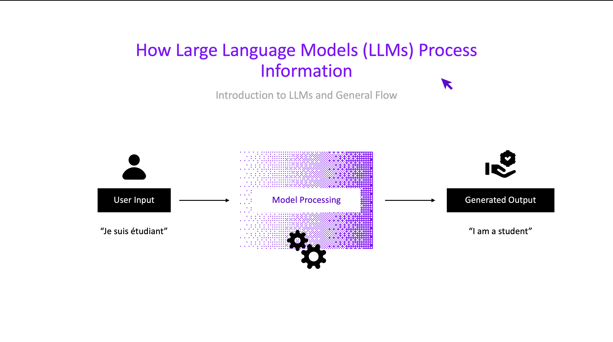
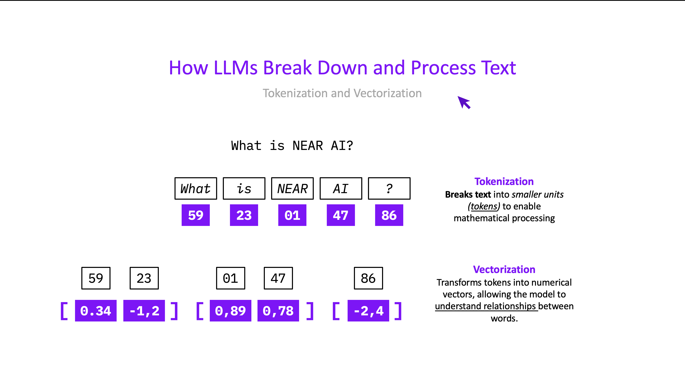
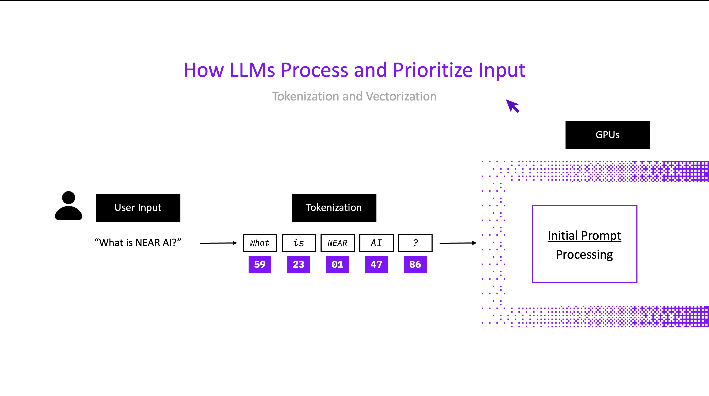
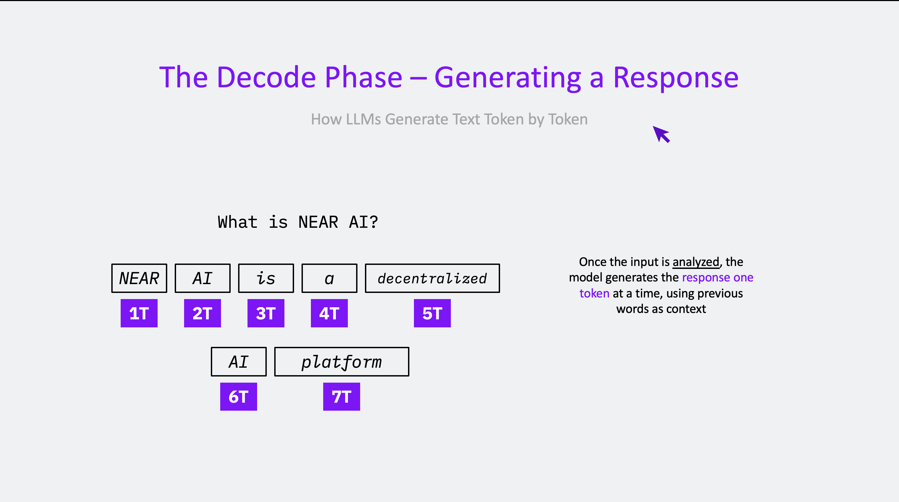
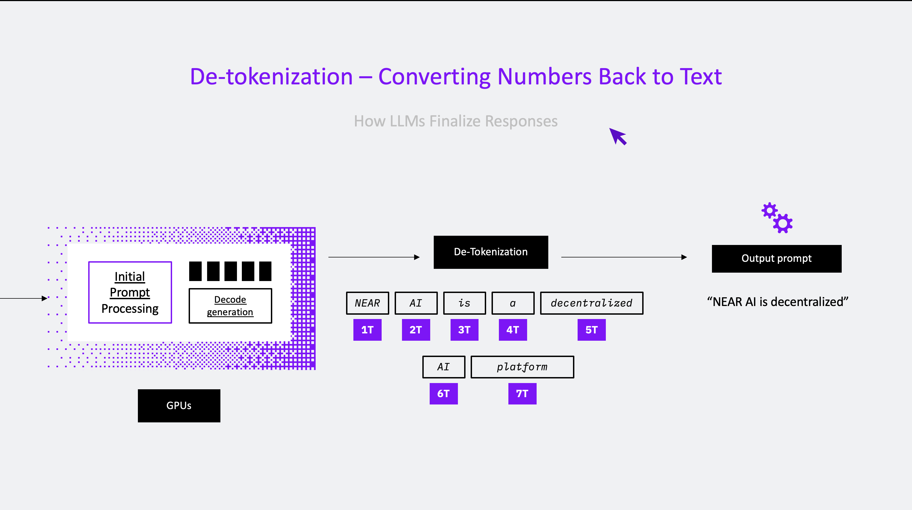
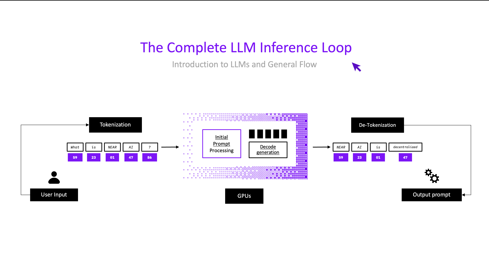

# How Large Language Models (LLMs) Process Information: A Step-by-Step Breakdown

In our previous guide, we explored what AI Agents are and how they operate. Now, we dive into the core intelligence behind them: **Large Language Models (LLMs).**

When you ask an LLM a question like **"What is NEAR AI?"**, the model does not retrieve a prewritten response. Instead, it follows a structured process to **interpret the query, analyze its knowledge, and generate a coherent response**. This guide provides a comprehensive breakdown of the **LLM inference process**, using a practical example to illustrate each stage.

## 1. Input and Output Flows

This section provides a **high-level overview** of how an LLM processes an input and generates an output. More detailed explanations of each step will follow in later sections.

### 1.1. Overview of the LLM Inference Process

When a user inputs **"What is NEAR AI?"**, the model follows these steps:

1. **Receives the raw input** as a sequence of characters.
2. **Tokenizes the text** into numerical representations.
3. **Processes the input using memory, attention mechanisms, and stored knowledge** to determine how to respond.
4. **Generates tokens one by one** in the Decode Phase.
5. **De-tokenizes the generated tokens** to form the final human-readable text.



Each of these steps will be explained in detail in later sections.

## 2. Tokenization and Vectorization

### 2.1. What is Tokenization?

Tokenization is the process of **breaking down text into smaller units (tokens)** so that the model can process them mathematically. Different tokenization techniques exist, and some models split words into **full tokens**, while others break them into **subwords or characters**. The tokenization process depends on the **model’s vocabulary and training approach**.

**Input:**
```
"What is NEAR AI?"
```
**Tokenized Representation:**
```
["What", " is", " NE", "AR", " AI", "?"] → [1034, 56, 7893, 4567, 215, 29]
```
<p align="center"><em>Example 1. Converting raw text into tokenized form</em></p>

Each token is assigned a **unique number** from the model’s vocabulary. These numerical representations allow the model to **perform mathematical computations**.



### **2.2. Why Convert Tokens to Vectors?**

Once the input text is tokenized into numbers, it needs to be **converted into vectors** so the model can process relationships between words effectively. Each token is mapped to a **vector in a high-dimensional space**, where similar words are placed closer together.

```
[1034, 56, 7893, 4567, 215, 29] → [[0.34, -1.23, 0.89], [0.78, 0.45, -0.67], ...]
```
<p align="center"><em>Example 2. Vectorization Representation</em></p>

These vector representations allow the model to **analyze word relationships based on their meanings rather than just individual character sequences**.

## **3. Initial Prompt Processing and Attention Mechanism**

### **3.1. Understanding the Prefill Phase**

When an LLM receives an input, it does **not immediately generate a response**. Instead, it first **analyzes the entire input** in a process called **Prefill Phase**. This phase ensures that the model **understands the context and retrieves relevant knowledge before producing an output**.



During the Prefill Phase, the model:

- **Processes the entire input at once** to grasp the full context.
- **Identifies key words and relationships** to decode the core meaning of the query.
- **Activates the Attention Mechanism** to prioritize relevant parts of the text.

This structured analysis ensures that the model **generates a contextually appropriate answer rather than treating all words equally**.

### **3.2. How Attention Heads Work: A Real-World Analogy**

When an LLM processes **"What is NEAR AI?"**, it doesn’t just look at the words equally. Instead, it **analyzes relationships between tokens** using **multiple Attention Heads**, each interpreting the input from a **different perspective**.

| **Attention Head** | **Focus Area** |
| --- | --- |
| **Head 1 (The Product Manager)** | Retrieves information on **how developers use NEAR AI** to build AI-powered applications. |
| **Head 2 (The Community Manager)** | Looks at how NEAR AI interacts with **its developer and research community**. |
| **Head 3 (The Blockchain Engineer)** | Focuses on the **technical aspects of decentralization and smart contracts**. |
<p align="center"><em>Example 3. How Different Team Members (Attention Heads) Interpret "What is NEAR AI?"</em></p>

Each **Attention Head** is like **one of these team members**, processing the **same input** but through a **different set of learned weights (WQ, WK, WV)**.

- Instead of relying on **one perspective**, the model **combines multiple viewpoints** to create a **more accurate and context-aware response**.
- The **final answer** is a **fusion of insights** from all Heads, ensuring a well-rounded explanation.


> ⚠️ While we use the analogy of NEAR AI team members to explain **how different Attention Heads process the input differently**, it’s important to remember that **Attention Heads are purely mathematical components of the model, not separate AI entities.**

## **4. Decode Phase – Generating and Finalizing the Response**

Once the Prefill Phase is complete and the necessary knowledge has been retrieved, the model begins generating its response **one token at a time**.

### **4.1. How Does the Model Generate a Response?**

The model does **not generate the full sentence at once**. Instead, it predicts **one token at a time**, appending each new token to the sequence before generating the next one.

1. **First token** → `"NEAR"`
2. **Second token** → `" AI"`
3. **Third token** → `" is"`
4. **Fourth token** → `" a"`
5. **Fifth token** → `" decentralized"`
<p align="center"><em>Example 4. Token Generation Representation</em></p>



### **4.2. Finalizing the Response – De-tokenization**

De-tokenization is the final step in the inference process, where numerical token outputs are converted back into readable text.

```
[7893, 4567, 215, 29] → "NEAR AI is a decentralized AI platform."
```
<p align="center"><em>Example 5. De-tokenization Representation</em></p>

This ensures that the final response is **coherent and correctly formatted**.



## **5. The Complete LLM Inference Loop**

1. **User input:** `"What is NEAR AI?"`
2. **Tokenization:** Text is converted into tokens.
3. **Vectorization:** Tokens are embedded into numerical representations.
4. **Prefill Phase:** The model processes the input before generating output.
5. **Memory Retrieval:** Relevant knowledge is retrieved using weights and KV Cache.
6. **Decode Phase:** The model generates tokens sequentially.
7. **De-tokenization:** The final response is converted back to text.
8. **Final Output:** `"NEAR AI is a decentralized AI platform."`



## **What Comes Next?**

By breaking down each phase of LLM inference, we gain a clear understanding of how models process information from input to output. From tokenization to response generation, each stage ensures the model generates meaningful and accurate answers.

Now that we have explored how LLMs function, the next step is to apply this knowledge by understanding **how to build AI agents with NEAR AI**.

The next guide, **"Getting Started with NEAR AI,"** will introduce the fundamentals of NEAR AI’s framework, its decentralized approach to AI development, and the tools available to start building and deploying AI-powered applications. This transition will bridge the gap between understanding LLM inference and implementing real-world AI solutions within NEAR’s ecosystem.
